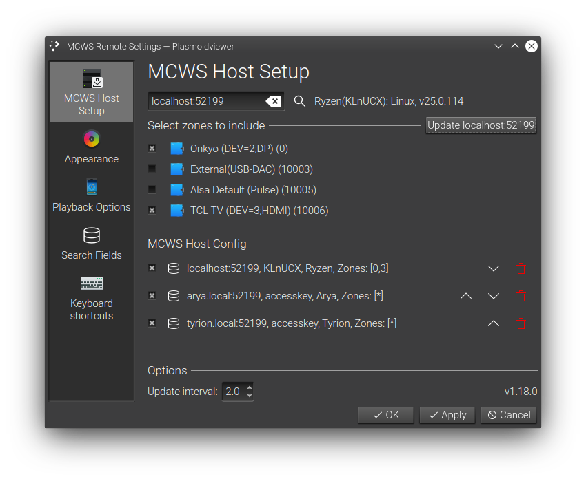
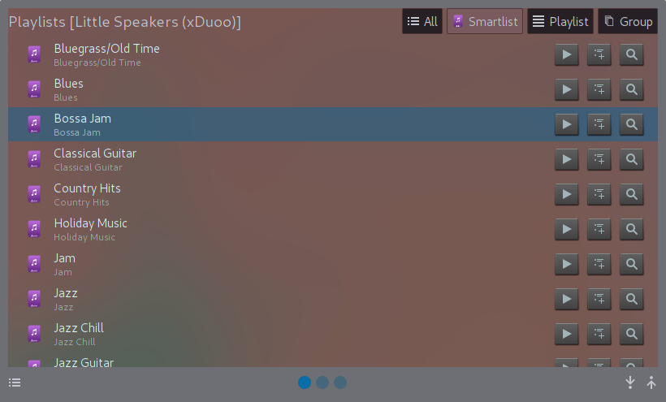

mcwsplasmoid
============
Plasmoid with basic playback support for [JRiver MediaCenter](http://jriver.com) Servers using MCWS

Screenshots
===========

Player Management
=================
* Multi-host/Multi-zone playback control (audio only)
* Host address only, access-key support and https support tbd
* Zone link
* Basic smartlist/playlist playback support (to be updated)
* Basic current playing now management

Installation
============

Installing from .plasmoid file:

    plasmapkg2 -i mcwsplasmoid.plasmoid

To upgrade, `plasmapkg2 -u mcwsplasmoid.plasmoid`

Installing from sources:

    git clone https://github.com/noee/mcwsplasmoid
    cd mcwsplasmoid
    plasmapkg2 -i ./plasmoid

To upgrade,  `plasmapkg2 -u ./plasmoid`

Development
===========

A .qbs project file is provided and can be used with QtCreator.  Just modify the
project run options to use plasmoidviewer or qmlscene.

The plasmoid uses the theme-based Plasma5 icons and has been tested with Oxygen and Breeze themes.
