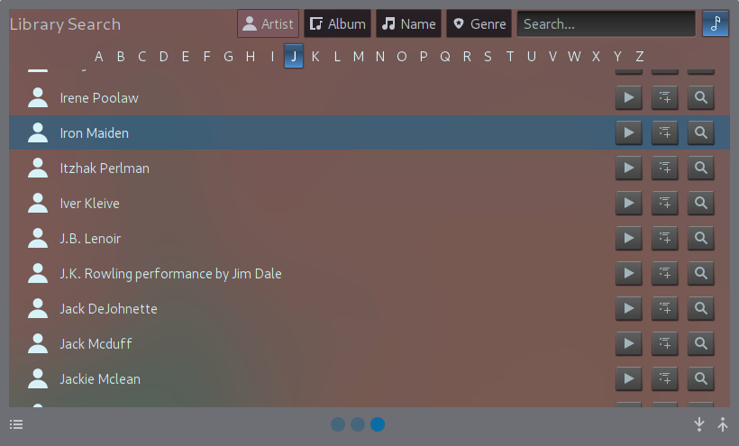

MCWS Remote Plasmoid
============

Plasmoid with basic search and playback control for [JRiver MediaCenter](http://jriver.com) Servers using MCWS

Screenshots
--------------

MediaCenter Remote Control
--------------
* Multi-host/Multi-zone playback control
* https support tbd
* Zone link
* Basic smartlist/playlist searching/playback support
* Basic current playing now control
* Show playback controls and current playing track directly in a Plasma5 Panel or Desktop

Installation
--------------
*  Requires Qt5.11+, Plasma 5.10+

*  Installing from .plasmoid file:
    * `plasmapkg2 -i mcwsplasmoid.plasmoid`

*  Upgrade
    * `plasmapkg2 -u mcwsplasmoid.plasmoid`

*  Installing from source:
    * `git clone https://github.com/noee/mcwsplasmoid`
    * `cd mcwsplasmoid`
    * `plasmapkg2 -i ./plasmoid`

Setup
--------------
*  Add the MCWS Widget to a Panel or the Desktop (works best with horizontal panels)
*  Goto Mcws Remote Options (right-click the icon)
*  Under Connections, enter the host names (or addresses) where your MC Servers reside
*  Click on a host to test the connection
*  Use the "Appearances" tab to change the plasmoid view options
*  Use the "Playback" tab to change MCWS playback options
*  Use the "Search Fields" tab to set MCWS fields sortable or searchable
*  Hit "OK", you're done!

Development
--------------
A .qbs project file is provided and can be used with QtCreator.  Just modify the
project run options to use plasmoidviewer or qmlscene.

The plasmoid has been tested with Plasma5 default themes.
