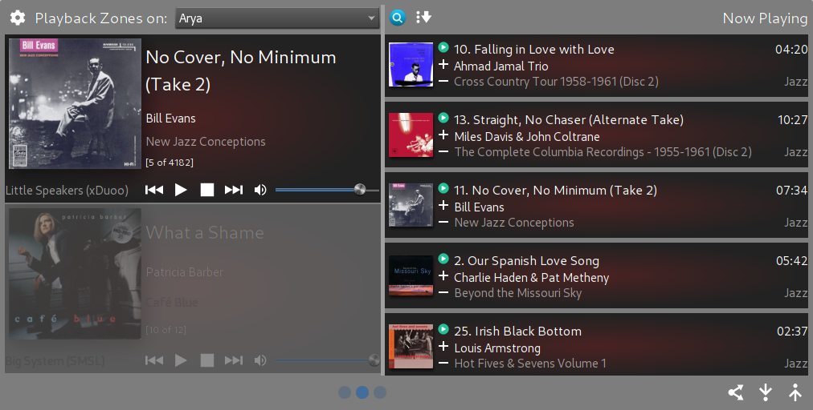

mcwsplasmoid
============

Plasmoid with basic search and playback control for [JRiver MediaCenter](http://jriver.com) Servers using MCWS

Screenshots
--------------

MediaCenter Remote Control
--------------
* Multi-host/Multi-zone playback control (audio only)
* Host address only, access-key support and https support tbd
* Zone link
* Basic smartlist/playlist playback support
* Basic current playing now management
* Show playback controls and current playing track directly in a Panel

Installation
--------------
*  Requires Qt5.7+, Plasma 5.8+

Installing from .plasmoid file:

    plasmapkg2 -i mcwsplasmoid.plasmoid

To upgrade, `plasmapkg2 -u mcwsplasmoid.plasmoid`

Installing from sources:

    git clone https://github.com/noee/mcwsplasmoid
    cd mcwsplasmoid
    plasmapkg2 -i ./plasmoid

To upgrade,  `plasmapkg2 -u ./plasmoid`

Setup
--------------
*  Add the MCWS Widget to a Panel or the Desktop
*  Goto Mcws Remote Options (right-click the icon)
*  Under Connections, enter the host names (or addresses) where your MC Servers reside (port is optional) semi-colon ";" delimited
*  Use the "Next" button to test the host connections
*  In the "Appearances" tab, you can change the behavior of the plasmoid views
*  Hit "OK", you're done!

Development
--------------
A .qbs project file is provided and can be used with QtCreator.  Just modify the
project run options to use plasmoidviewer or qmlscene.

The plasmoid uses the Plasma5 theme and has been tested with Oxygen and Breeze themes.
