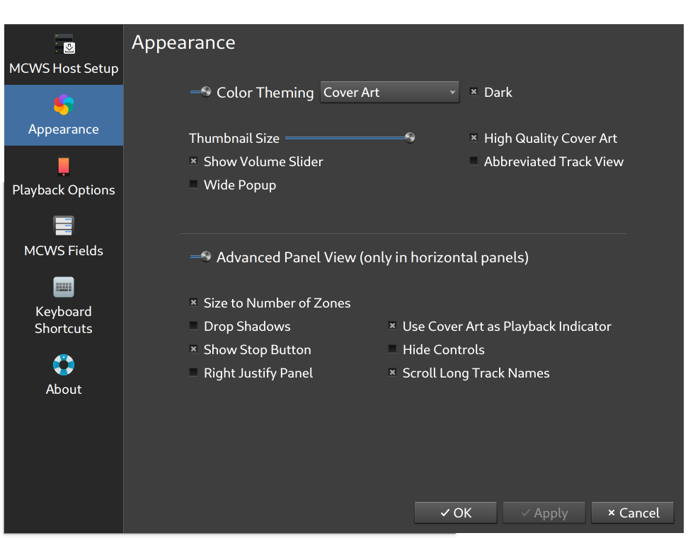

MCWS Remote Plasmoid
============

Plasmoid with basic search and playback control for [JRiver MediaCenter](http://jriver.com) Servers using MCWS

MediaCenter Remote Control
--------------
* Multi-host/Multi-zone playback control
* Zone link
* Smartlist/playlist searching/playback support
* Control playback on all zones for a MCWS server with just a few clicks
* Show playback controls and current playing track directly in a Plasma panel,
a Latte Dock panel or on the Desktop

Screenshots
--------------

Installation
--------------
*  Requires Qt5.12+, Plasma 5.12+, KDE Frameworks 5.69+, Kirigami 2.12+
    * (use v1.17.0 for KF5 versions < 5.69)

*  Installing from .plasmoid file:
    * `plasmapkg2 -i mcwsplasmoid.plasmoid`

*  Upgrade
    * `plasmapkg2 -u mcwsplasmoid.plasmoid`

*  Installing from source:
    * `git clone https://github.com/noee/mcwsplasmoid`
    * `cd mcwsplasmoid`
    * `plasmapkg2 -i ./plasmoid`

Setup
--------------
*  Add the MCWS Widget to a Panel or the Desktop (works best with horizontal panels)
*  Configure Mcws Remote Options (right-click the icon)
*  On MCWS Host Setup, search for the host names (or addresses) where your MC Servers reside
*  Click on a host to see the connection info and select zones to control
*  Use the "Appearances" tab to change the plasmoid view options
*  Use the "Playback" tab to change MCWS playback options
*  Use the "Search Fields" tab to set MCWS fields sortable or searchable
*  Hit "OK", you're done!

Web Stream Setup
--------------
When a web streaming source is setup,
MediaCenter will add it to the Web Media Playlist so it's available from the Playlists
page and normal audio searching.

There are some diffences to how MediaCenter handles reporting playback information:

*  SomaFM: Enter 'soma' into the tag 'Web Media Info' for the track once the source is set up

Development
--------------
A .qbs project file is provided and can be used with QtCreator.  Just modify the
project run options to use plasmoidviewer or qmlscene.

The plasmoid has been tested with Plasma5 and KVantum themes.
